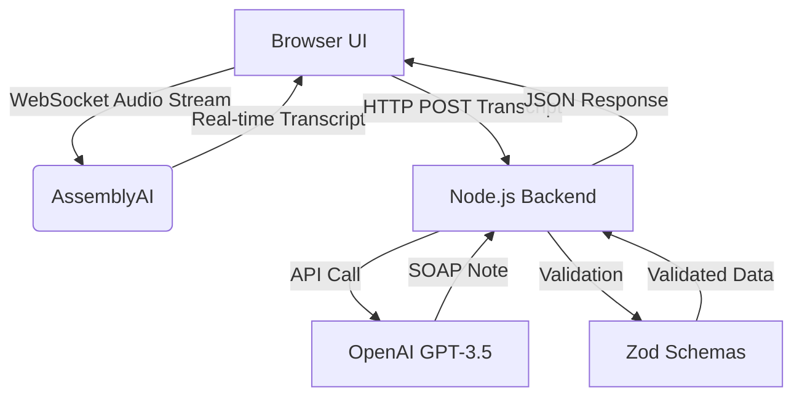

# Auto SOAP Generator

A web application that transcribes audio recordings and automatically generates SOAP (Subjective, Objective, Assessment, Plan) reports for healthcare professionals.

## Table of Contents
- [Demo](#demo)
- [Features](#features)
- [Prerequisites](#prerequisites)
- [Installation](#installation)
- [Usage](#usage)
- [Technology Stack](#technology-stack)
- [Contributing](#contributing)
- [License](#license)

## Demo

Visit the deployed application: [scribe-soap-scribe.lovable.app](https://scribe-soap-scribe.lovable.app)

## Features

- Real-time audio recording and transcription
- Automatic generation of structured SOAP reports from transcriptions
- User-friendly interface for healthcare professionals
- Fast and accurate processing

## Prerequisites

Before installing the application, ensure you have the following installed on your system:

- Node.js (v14 or later)
- npm (v6 or later)

## Installation

### Option 1: Use the Deployed Version

Simply visit [scribe-soap-scribe.lovable.app](https://scribe-soap-scribe.lovable.app) to use the application without any installation.

### Option 2: Local Installation

1. Clone the repository:
   ```bash
   git clone [repository-url]
   cd scribe-soap
   ```

2. Install dependencies:
   ```bash
   npm install
   ```

3. Start the development server:
   ```bash
   npm run dev
   ```

4. Open your browser and navigate to:
   ```
   http://localhost:8080/
   ```

## Usage

1. **Start Recording**:
   - Click the "Start Recording" button
   - Speak clearly into your microphone
   - The real-time transcription will appear in the text block

2. **End Recording**:
   - Click the "Stop Recording" button when you've finished speaking

3. **Generate SOAP Report**:
   - Click the "Generate SOAP Report" button
   - The application will process your transcription and generate a structured SOAP report
   - Review the generated report in the designated area

## Technology Stack

### Backend
- **Node.js** with **TypeScript** - Server-side runtime and language
- **Zod** - Schema validation library

### Frontend
- **React** with **Vite.js** - UI framework and build tool

### Services
- **AssemblyAI** - Streaming audio transcription service
- **OpenAI GPT-3.5 Turbo** - Natural language processing for SOAP report generation

## Architecture Flow



## Contributing

Contributions are welcome! Please feel free to submit a Pull Request.
